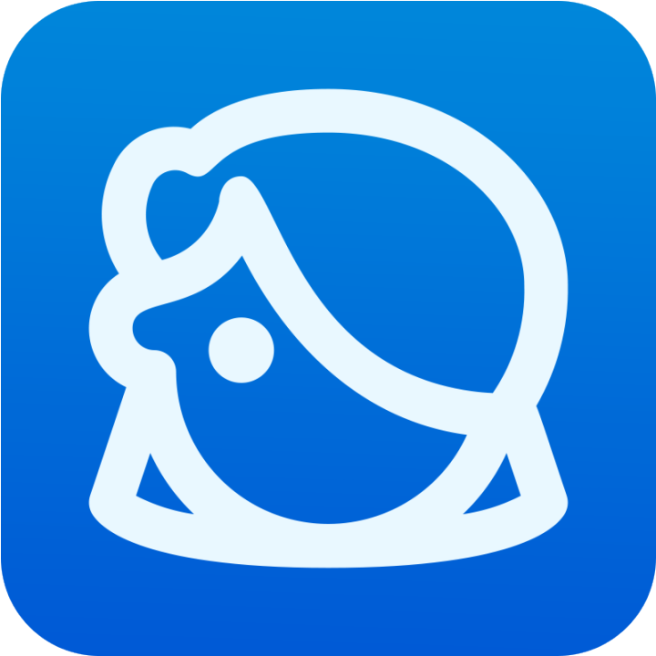

<h1 style="display: flex; justify-content: space-between; align-items: center; width: 100%;">
  

    
    Lya – Assistante Numérique de Guidance Web
  

</h1>

  
<strong>🏆 Prix du Jury – Hackathon du MIC 2025</strong> 
  

  

  <!-- SECTION DESCRIPTION -->

  <h2>🧠 Qu’est-ce que Lya ?</h2>

  
<strong>Lya</strong> est une assistante virtuelle conçue pour guider les utilisateurs pas à pas dans leurs démarches en ligne.

  
Elle simplifie l'accès aux sites web, notamment administratifs ou complexes, en expliquant chaque étape de manière claire et accessible directement sur la page.

  
<strong>🎯 Notre objectif :</strong> rendre le web plus humain et plus inclusif, en favorisant l’autonomie numérique pour tous et toutes.

  

  <h2>💡 Fonctionnalités clés</h2>

  <ul style="list-style-type: none; padding: 0; text-align: left;">
    <li>🔍 <strong>Analyse des pages web en temps réel :</strong> Lya comprend la structure d’une page et identifie les éléments clés à guider.</li>
    <li>💬 <strong>Assistance conversationnelle :</strong> Une interface de chat simple et intuitive pour poser des questions et recevoir des réponses adaptées.</li>
    <li>🧭 <strong>Guidage pas à pas :</strong> Lya propose des instructions étape par étape lors de tâches plus complexes pour guider l'utilisateur.</li>
    <li>🌐 <strong>Accessibilité et inclusivité :</strong> Pensée pour tous les niveaux de maîtrise numérique.</li>
  </ul>

  

  <!-- SECTION OBJECTIFS -->

  <h2>🏁 Objectifs à venir</h2>

  
🚧 <strong>Prochaine étape : Lya V2</strong> – Plus fluide, plus intelligente, plus universelle. On veut que Lya s’adapte à <strong>toutes</strong> les pages web, même les plus obscures !

  
🧪 Tests utilisateurs, IA plus fine, meilleure UX : on est en route pour une version encore plus ambitieuse.

  

  <!-- SECTION ÉQUIPE -->

  <h2>👥 L’équipe derrière Lya</h2>

  <ul style="list-style-type: none; padding: 0;">
  <li><a href="https://www.linkedin.com/in/julien-decock-ab619b32b">Julien Decock</a></li>
  <li><a href="https://www.linkedin.com/in/marcel-angielczyk/">Marcel Angielczyk</a></li>
  <li><a href="https://www.linkedin.com/in/maximilien-montier-383666318/">Maximilien Montier</a></li>
  <li><a href="https://www.linkedin.com/in/thomas-gillet-4245a1294">Thomas Gillet</a></li>
  <li><a href="https://www.linkedin.com/in/emilien-marquegnies/">Emilien Marquegnies</a></li>
